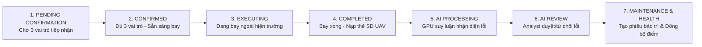

# 📋 ĐẶC TẢ LOGIC TUYẾN TÍNH (LINEAR WORKFLOW) & CÁC API CẦN BỔ SUNG CHO MF02
## V/v: Chuẩn hóa Vòng đời Nhiệm vụ (Mission Lifecycle), Ngăn chặn Dữ liệu Phi Tuyến tính & Danh mục API Backend cần cung cấp

> **Người gửi**: Đội ngũ Frontend (Angular 20 Standalone)  
> **Người nhận**: Đội ngũ Backend (ASP.NET Core / EF Core / SignalR / AI Inference Engine)  
> **Tài liệu liên quan**: 
> - [MF02 v2.0 Specification](file:///e:/UavPms_FE/docs/mainflows/MF02_v2.0_FE_Create_Assign_Mission.md)
> - [Backend Response Multi-Role Workflow](file:///e:/UavPms_FE/docs/BACKEND_RESPONSE_MULTI_ROLE_WORKFLOW_MF01_MF02.md)
> 
> **Mức độ ưu tiên**: 🔴 **Nghiêm trọng (High / Critical - Quyết định tính đúng đắn của dữ liệu nghiệp vụ)**

---

## 1. Bản chất Vấn đề & Nguyên nhân Dữ liệu Phi Tuyến tính (Root Cause Analysis)

Hiện tại trên hệ thống đang gặp hiện tượng **phi tuyến tính (non-linear data leak)**:
1. **Nhiệm vụ mới tạo (Đang chờ xác nhận / Pending Confirmation)** nhưng các tab sau đã có dữ liệu:
   - **Tab Kết quả AI (`results`)**: Đã hiển thị sẵn danh sách khuyết tật, khung Bounding Box, Video scrubber tua frame lỗi.
   - **Tab Bảo trì (`maintenance`)**: Đã hiển thị sẵn 3 phiếu khuyến nghị công tác sửa chữa (thay bát sứ, xiết bu lông xà, phát quang cây).
   - **Tab Hoạt động (`activity`)**: Cột mốc "Inspector xác nhận" bị hiển thị hoàn thành mặc dù phi công và các vai trò khác thực tế chưa bấm tiếp nhận.
2. **Nguyên nhân kỹ thuật**:
   - **Phía Frontend**: Khi gọi API lấy dữ liệu mà Backend trả về mảng rỗng `[]` (do nhiệm vụ mới tạo chưa bay, chưa có ảnh), Frontend trước đó đã tự động **fallback sang mảng dữ liệu mẫu (mock data)** để phục vụ xem trước giao diện. Việc này khiến giao diện hiển thị sai thực tế vòng đời.
   - **Phía Backend**: 
     - Chưa có các API chuyên biệt theo `missionId` cho Detections, Maintenance Tasks, Activity Stream.
     - Chưa áp dụng State Machine Guard (chặn không cho phép nạp dữ liệu hoặc truy vấn kết quả khi nhiệm vụ chưa hoàn thành chuyến bay).

---

## 2. Ma trận Vòng đời Tuyến tính Chuẩn (Standard Linear Mission Lifecycle)

Quy trình thực hiện một nhiệm vụ kiểm tra đường dây UAV-PMS phải tuân thủ nghiêm ngặt **7 giai đoạn tuyến tính (Linear Stages)**:



### Bảng Ma trận Ánh xạ Giai đoạn $\leftrightarrow$ Trạng thái Dữ liệu các Tab

| Giai đoạn | Trạng thái Nhiệm vụ (`status`) | Tab Tổng quan (`overview`) | Tab Tải dữ liệu (`upload`) | Tab Phân tích AI (`processing`) | Tab Kết quả AI (`results`) | Tab Tài sản (`assets`) | Tab Bảo trì (`maintenance`) |
| :--- | :--- | :--- | :--- | :--- | :--- | :--- | :--- |
| **1. Phân công** | `PENDING_CONFIRMATION` / `Assigned` | Đếm ngược hạn chót, ma trận 3 roles đang chờ tiếp nhận | 🔒 Khóa hoặc hướng dẫn "Chờ đội ngũ xác nhận nhiệm vụ" | ⚪ Trống (`mediaQueue = []`) | ⚪ Trống (Empty State: Chưa bay khảo sát) | Danh mục thiết bị cần kiểm tra (Health score giữ nguyên kỳ trước, lỗi = 0) | ⚪ Trống (Empty State: Chưa có lỗi duyệt) |
| **2. Sẵn sàng** | `CONFIRMED` | 100% 3 vai trò đã chấp nhận, hiển thị nút xuất phát | 🔒 Sẵn sàng tiếp nhận sau bay | ⚪ Trống | ⚪ Trống | Danh mục thiết bị cần kiểm tra | ⚪ Trống |
| **3. Đang bay** | `EXECUTING` | Stream tọa độ UAV, telemetry độ cao, tốc độ, camera hiện trường | 🔒 Đang bay, chờ hoàn tất để lấy thẻ nhớ | ⚪ Trống | ⚪ Trống | Danh mục thiết bị | ⚪ Trống |
| **4. Nạp dữ liệu** | `COMPLETED` / `DATA_PENDING` | Báo cáo chuyến bay hoàn tất | 🟢 Mở cho Inspector kéo thả ảnh/video UAV | ⚪ Hàng đợi sẵn sàng | ⚪ Trống | Danh mục thiết bị | ⚪ Trống |
| **5. Phân tích AI** | `PROCESSING` | Tiến độ xử lý GPU TensorRT | Đã tải xong media | 🟢 Hiển thị pipeline 4 bước đang quét từng frame | ⚪ Đang trích xuất | Danh mục thiết bị | ⚪ Trống |
| **6. Giám định AI** | `ANALYZING` / `EVALUATED` | Thông báo số lỗi AI phát hiện | Lưu trữ media gốc | Đã phân tích xong | 🟢 Hiển thị Bounding Box, video scrubber để **Analyst** duyệt/từ chối | Cập nhật số lỗi AI phát hiện | ⚪ Trống (Chờ duyệt lỗi) |
| **7. Bảo trì** | `CLOSED` / `MAINTENANCE_PENDING` | Hoàn tất toàn bộ chu trình MF02 | Lưu trữ media | Lưu trữ kết quả | Hiển thị kết quả đã thẩm định | Cập nhật Health Score giảm theo mức độ lỗi | 🟢 Tự động sinh phiếu bảo dưỡng từ các lỗi **Approved** |

---

## 3. Danh sách Chi tiết các API Backend Còn Thiếu & Cần Bổ Sung

Để Frontend không phải dùng dữ liệu giả lập và hệ thống vận hành đúng quy chuẩn tuyến tính, Backend cần cung cấp các endpoint sau:

### 📌 API 1: Truy xuất Kết quả AI theo Nhiệm vụ (Mission Detections API)
- **Endpoint**: `GET /api/v1/missions/{id}/detections`
- **Mục đích**: Lấy danh sách khuyết tật AI phát hiện được từ các tệp media thuộc nhiệm vụ `{id}`.
- **Query Params**:
  - `status`: Lọc theo trạng thái kiểm duyệt (`Pending`, `Approved`, `Rejected`).
  - `mediaType`: `video` hoặc `image`.
  - `isEmergency`: `true` hoặc `false`.
- **Response Schema** (`200 OK`):
  ```json
  [
    {
      "id": "det-uuid-001",
      "missionId": "mis-uuid-123",
      "mediaId": "med-uuid-456",
      "title": "Bát sứ cách điện bị nứt vỡ",
      "confidence": 94.5,
      "categoryCode": "DEF-INS-CRACK",
      "severityWeight": 5,
      "isEmergency": true,
      "status": "Pending", // "Pending" | "Approved" | "Rejected"
      "boundingBox": { "x": 36.5, "y": 28.2, "width": 24.0, "height": 30.5 },
      "timestampSeconds": 14.5,
      "timestampLabel": "00:14",
      "frameIndex": 435,
      "imageUrl": "https://minio.evn.vn/uav-media/crop-001.jpg",
      "sourceUrl": "https://minio.evn.vn/uav-media/flight-video-01.mp4",
      "assetId": "ast-insulator-042",
      "tower": "Cột 042 (Néo)",
      "gps": "20°58'14.2\"N 105°48'22.6\"E",
      "description": "Vết nứt bề mặt đĩa sứ cách điện chuỗi đỡ néo pha B",
      "detectedAt": "2026-09-25T08:30:00Z",
      "reviewedByUserId": null,
      "reviewedAt": null,
      "reviewNotes": null
    }
  ]
  ```
  *(Nếu nhiệm vụ chưa chạy phân tích AI, trả về `[]` rỗng với status `200 OK`, tuyệt đối không trả lỗi 500).*

---

### 📌 API 2: Phê duyệt / Từ chối Kết quả AI (Review Detection API)
- **Endpoint**: `POST /api/v1/missions/{missionId}/detections/{detectionId}/review`
- **Mục đích**: Dành cho vai trò **Analyst** xác nhận khuyết tật là chính xác hoặc báo AI nhận diện sai.
- **Request Body**:
  ```json
  {
    "status": "Approved", // "Approved" hoặc "Rejected"
    "reviewNotes": "Đã đối chiếu ảnh chụp góc nghiêng, vết nứt sâu có nguy cơ phóng điện.",
    "overrideSeverity": "Critical Risk" // Tùy chọn nếu chuyên viên muốn điều chỉnh mức độ
  }
  ```
- **Hành vi Backend**:
  - Khi chuyển sang `Approved`: Tự động trigger cập nhật giảm Health Score của thiết bị liên quan trong bảng `Assets` và tự động sinh bản ghi khuyến nghị trong bảng `MaintenanceTasks`.
  - Khi chuyển sang `Rejected`: Đánh dấu AI sai, không trừ điểm thiết bị, không tạo khuyến nghị bảo trì.

---

### 📌 API 3: Truy xuất Khuyến nghị Bảo dưỡng theo Nhiệm vụ (Mission Maintenance Tasks API)
- **Endpoint**: `GET /api/v1/missions/{id}/maintenance-tasks`
- **Mục đích**: Lấy danh sách phiếu đề xuất bảo dưỡng được sinh ra từ các lỗi `Approved` của nhiệm vụ.
- **Response Schema** (`200 OK`):
  ```json
  [
    {
      "id": "maint-uuid-001",
      "missionId": "mis-uuid-123",
      "detectionId": "det-uuid-001",
      "title": "Thay thế khẩn cấp bát sứ nứt vỡ chuỗi néo pha B",
      "priority": "Urgent", // "Urgent" | "High" | "Medium" | "Low"
      "towerCode": "Cột 042",
      "assetCode": "INS-220KV-042-PHA-B",
      "defectDescription": "Bát sứ số 4 chuỗi néo bị nứt vỡ bề mặt có nguy cơ phóng điện rã lưới.",
      "suggestedAction": "Cắt điện xuất tuyến, điều xe gầu chuyên dụng thay mới chuỗi cách điện polymer 220kV trong 24h.",
      "status": "Pending", // "Pending" | "Approved" | "InProgress" | "Completed"
      "assignedTeam": "Đội Truyền tải Điện Hà Nội 1",
      "createdAt": "2026-09-25T09:00:00Z"
    }
  ]
  ```
  *(Nếu chưa có lỗi nào được Approved, trả về `[]` rỗng).*

---

### 📌 API 4: Luồng Trao đổi & Nhật ký Hoạt động (Communication & Activity Stream API)
- **Endpoint 1 (Lấy danh sách)**: `GET /api/v1/missions/{id}/activities`
- **Endpoint 2 (Gửi tin nhắn)**: `POST /api/v1/missions/{id}/activities`
- **Mục đích**: Lưu trữ thông tin chỉ đạo của Quản lý vận hành (Manager), báo cáo của Phi công (Inspector), và các mốc hệ thống tự động ghi nhận.
- **Payload gửi tin nhắn (`POST`)**:
  ```json
  {
    "content": "Thời tiết hiện trường tại cột 42 gió cấp 3, tầm nhìn tốt, sẵn sàng cất cánh.",
    "senderRole": "INSPECTOR" // Lấy từ User context hoặc JWT
  }
  ```
- **Response Schema (`GET`)**:
  ```json
  [
    {
      "id": "act-uuid-001",
      "missionId": "mis-uuid-123",
      "senderUserId": "usr-uuid-inspector",
      "senderName": "Nguyễn Văn Bay",
      "senderRole": "INSPECTOR", // "MANAGER" | "INSPECTOR" | "SYSTEM"
      "content": "Thời tiết hiện trường tại cột 42 gió cấp 3, tầm nhìn tốt, sẵn sàng cất cánh.",
      "timestamp": "2026-09-25T07:15:00Z"
    }
  ]
  ```

---

### 📌 API 5: Danh sách & Trạng thái Phân công Đa Vai trò (Multi-Role Assignments API)
- **Endpoint**: `GET /api/v1/missions/{id}/assignments`
- **Mục đích**: Trả về danh sách chi tiết các nhân sự được phân công kèm trạng thái xác nhận của từng người để vẽ Team Matrix ở trang Tổng quan.
- **Response Schema** (`200 OK`):
  ```json
  {
    "missionId": "mis-uuid-123",
    "totalRequiredCount": 3,
    "confirmedCount": 1,
    "allConfirmed": false,
    "confirmationDeadline": "2026-09-25T20:00:00Z",
    "assignments": [
      {
        "id": "assign-uuid-01",
        "userId": "usr-uuid-01",
        "userName": "inspector_hung",
        "userFullName": "Phạm Văn Hùng",
        "assignmentRole": "INSPECTOR",
        "status": "Active",
        "responseStatus": "Accepted", // "Pending" | "Accepted" | "Postponed" | "Replaced"
        "assignedAt": "2026-09-25T06:00:00Z",
        "respondedAt": "2026-09-25T06:30:00Z",
        "responseReason": null
      },
      {
        "id": "assign-uuid-02",
        "userId": "usr-uuid-02",
        "userName": "analyst_minh",
        "userFullName": "Lê Quang Minh",
        "assignmentRole": "ANALYST",
        "status": "Active",
        "responseStatus": "Pending",
        "assignedAt": "2026-09-25T06:00:00Z",
        "respondedAt": null,
        "responseReason": null
      },
      {
        "id": "assign-uuid-03",
        "userId": "usr-uuid-03",
        "userName": "tech_tuan",
        "userFullName": "Trần Anh Tuấn",
        "assignmentRole": "TECHNICIAN",
        "status": "Active",
        "responseStatus": "Pending",
        "assignedAt": "2026-09-25T06:00:00Z",
        "respondedAt": null,
        "responseReason": null
      }
    ]
  }
  ```

---

## 4. Các Xử lý Frontend Đã Hoàn Tất Ngay Lập Tức

Để đảm bảo tính nhất quán dữ liệu ngay trên giao diện hiện tại:
1. **Xóa bỏ 100% Mock Fallback**:
   - `loadDetections`: Khi API trả về mảng rỗng `[]`, Frontend giữ nguyên `detections = []`, không tự ý kích hoạt 3 khuyết tật mẫu.
   - `maintenanceTasks`: Khởi tạo mặc định `[]`, không gán sẵn 3 task sửa chữa giả lập.
2. **Bổ sung Khung Trống Thông minh (Linear Empty States)**:
   - **Tab Kết quả AI**: Hiển thị bảng thông báo chuẩn: *"Chưa có dữ liệu Giám định AI. Nhiệm vụ chưa hoàn thành bay khảo sát hoặc chưa nạp ảnh/video UAV để chạy mô hình AI"*.
   - **Tab Bảo trì**: Hiển thị bảng thông báo: *"Chưa có Khuyến nghị Bảo dưỡng. Chưa có khuyết tật nào được Phân tích viên (Analyst) xác nhận lỗi để lập phiếu công tác sửa chữa"*.
   - **Tab Tài sản**: Chỉ số "Nguy cấp" và "Ổn định" được tính toán động theo dữ liệu thực của tài sản (`healthScore > 0 && healthScore < 40`), không hiển thị số ảo.
3. **Chuẩn hóa Cột mốc Tiến trình Tuyến tính (Audit Trail Milestones)**:
   - Cột mốc xác nhận đã được đổi thành: **"Đội ngũ 3 Vai trò Tiếp nhận & Xác nhận"**.
   - Chỉ đánh dấu `completed` khi `allRolesConfirmed()` đạt 100% (hoặc `status === 'CONFIRMED'`).
   - Cột mốc bay chỉ hoàn thành khi `status === 'Completed'`.
   - Cột mốc suy luận AI chỉ hoàn thành khi có kết quả phát hiện thực tế (`detections.length > 0`).
   - Cột mốc bảo trì chỉ hoàn thành khi có lỗi được duyệt (`approvedDetectionCount > 0`).

---

## 5. Đề xuất Kế hoạch Phối hợp Tiếp theo

1. **Phía Backend**:
   - Triển khai 5 nhóm API theo đặc tả ở Mục 3.
   - Kiểm tra logic chuyển trạng thái tự động (`PENDING_CONFIRMATION` $\rightarrow$ `CONFIRMED`) khi đủ 3 roles `Accepted`.
2. **Phía Frontend**:
   - Tích hợp trực tiếp các endpoint trên ngay khi Backend publish lên môi trường dev/staging.
   - Hoàn thiện luồng kiểm soát quyền hạn (Role-based access guard) theo vai trò đăng nhập.
